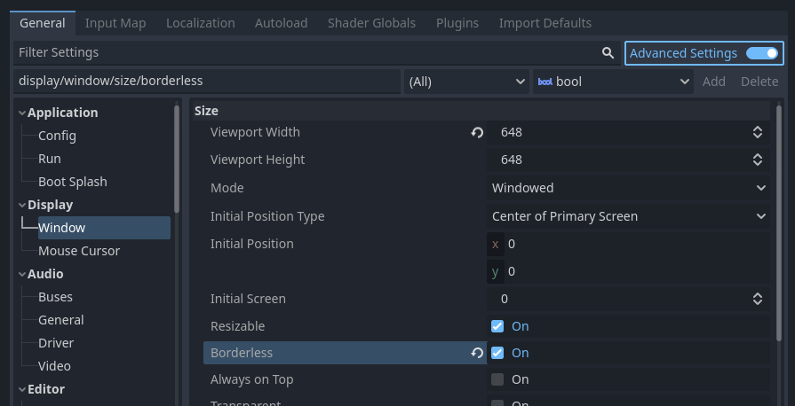
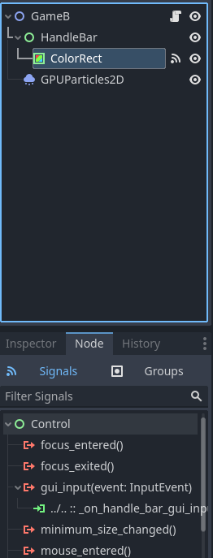

# LittleGodotFun
Prosty program do komunikacji między dwoma grami godotowymi oraz instrukcja do robienia własnych okienek do gier godotowych.

# Instrukcja do komunikacji międzygrowej
Stwórz dwa projekty w godocie. Do jednego wsadź game_a.tscn i game_a.gd, a do drugiej game_b.

Załaduj plik skryptowy (.gd) do sceny (.tscn) klikając na kartkę z zielonym plusem.

Wejdź w Project -> Project Settings i kliknij opcję Advanced Settings.

Ustaw Use Custom User Dir i wpisz jego ścieżkę.

Na powyższym obrazku tworzymy w naszym folderze AppData/Roaming folder o nazwie SharedGame, a w środku niego folder o nazwie GameA. 

W tym właśnie folderze godot będzie zapisywać wszystkie pliki oraz logi.

Następnie musimy zrobić to samo w drugim projekcie game_b.

Podłącz kod do sceny. Wejdź w Project Settings i ustaw Custom User Dir.

I to wszystko! Włącz obie gry i zobacz jak naciśnięcie przycisku w jednej wysyła sygnał do drugiej!

Mechanizm ten korzysta z faktu, że gry te dzielą ten sam Custom User Dir - SharedGame. Wystarczy więc zmienić nazwę podfolderu z GameB na GameA i można czytać pliki zapisu naszej bliźniaczej gry!

(zobacz jak jest to zrealizowane w kodzie)

# Instrukcja do customowych okienek
Na początku należy ustawić w opcjach Display -> Window wartość Borderless na On.

Następnie wejść w Node'a ColorRect, zmienić widok inspectora na Node i dodać sygnał gui_input.

Kliknąć connect.

Teraz nasz kolorowy pasek będzie działał jak window handler w normalnym okienku. 

Można dodać do niego customowe przyciski np. X do wyłączania gry.

Można też dodać resztę obramowania okna i wszystko inne czego dusza zapragnie!
